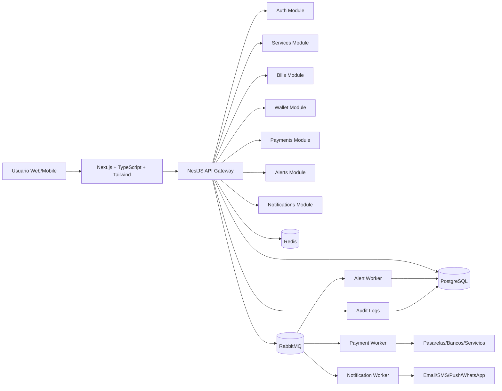
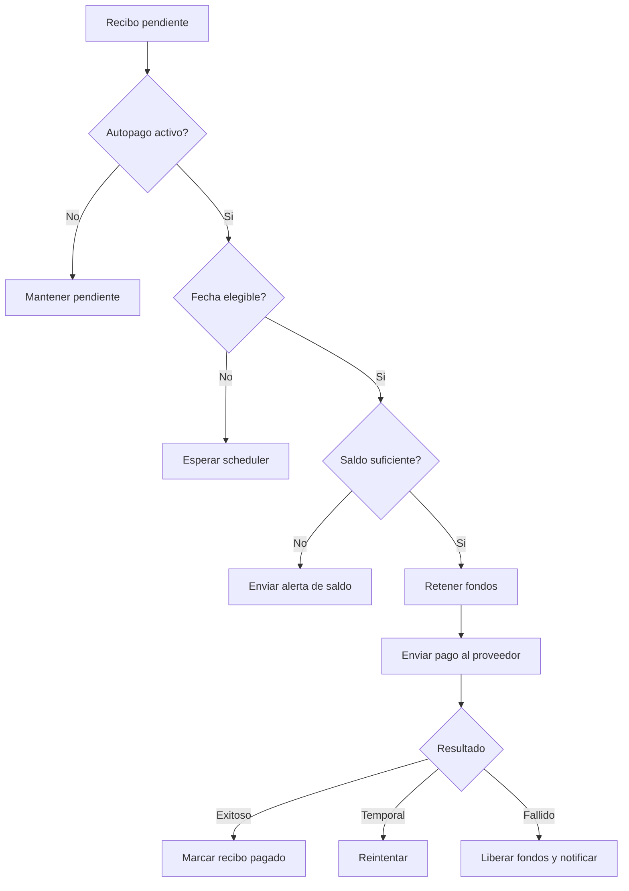
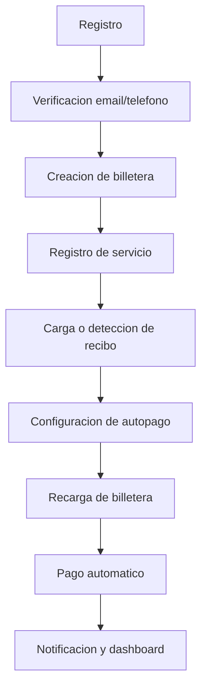
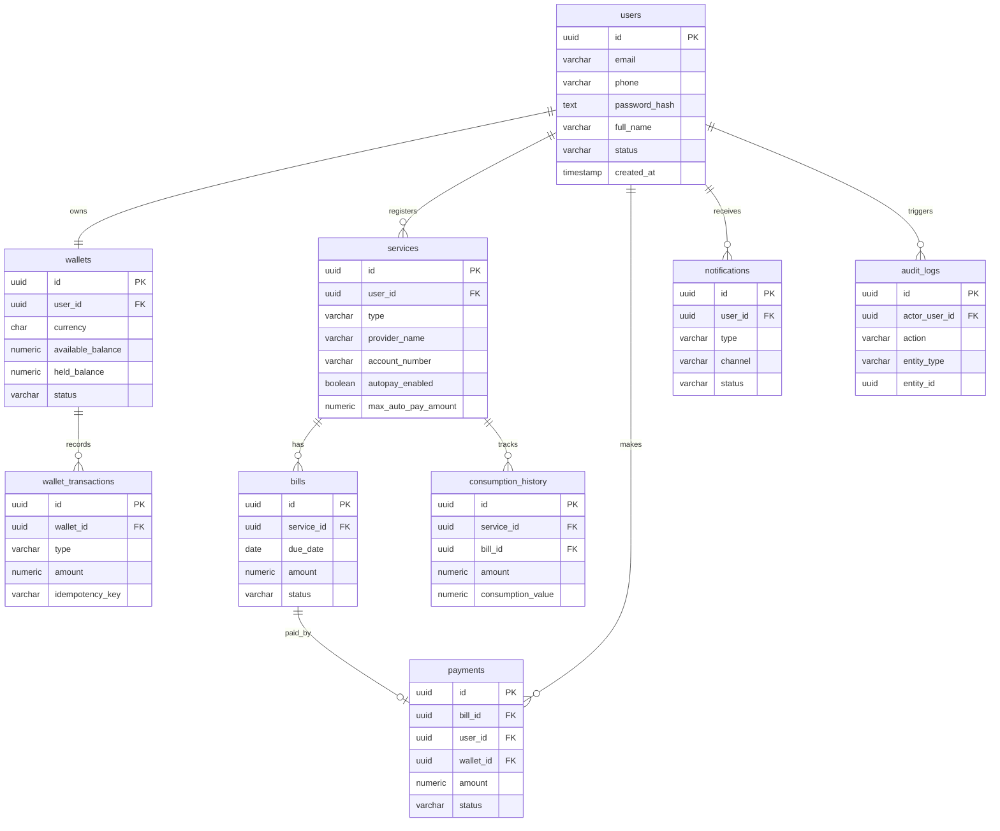
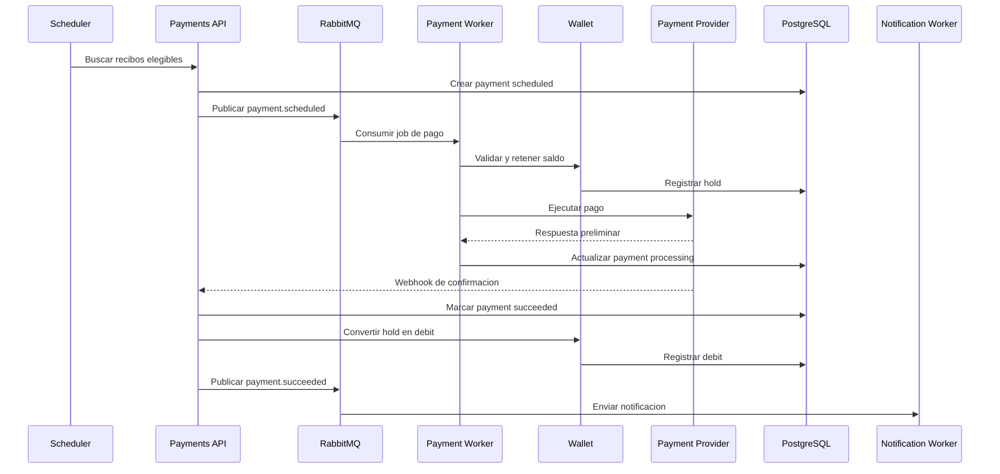

# AutoPago - Documentacion de Producto, Software y Arquitectura

> Nombre temporal: **AutoPago**  
> Tipo de producto: **SaaS Fintech para automatizacion de pagos de recibos domesticos**  
> Audiencia: inversionistas, CTOs, arquitectos de software, equipos fintech y desarrolladores senior  
> Estado: documento inicial de definicion profesional  

---

## 0. Resumen Ejecutivo

AutoPago es una plataforma SaaS que automatiza la gestion y pago de recibos domesticos como agua, luz, internet, telefonia y gas. El usuario registra sus servicios, deposita saldo en una billetera virtual y configura reglas para que el sistema pague automaticamente los recibos antes de su vencimiento.

La plataforma tambien analiza historicos de consumo y gasto para detectar incrementos anormales, vencimientos proximos, falta de saldo y oportunidades de optimizacion financiera. El objetivo es evolucionar desde un sistema de pagos automaticos hacia un asistente financiero domestico inteligente.

### Objetivos estrategicos

- Reducir olvidos, moras, cortes de servicio y pagos tardios.
- Centralizar recibos domesticos en una sola experiencia digital.
- Permitir pagos automaticos seguros mediante billetera virtual.
- Generar alertas inteligentes sobre consumo, saldo y comportamiento financiero.
- Construir una base escalable para servicios B2C, B2B2C, condominios y multiempresa.

### Supuestos iniciales

- El producto operara inicialmente en Peru o Latinoamerica, con integraciones a pasarelas y billeteras como Niubiz, Izipay, Mercado Pago, Yape, Plin y bancos.
- La plataforma no debe custodiar dinero sin evaluar previamente obligaciones regulatorias.
- El MVP puede iniciar con integraciones semiautomaticas o mediante proveedores agregadores antes de negociar integraciones directas con cada empresa de servicios.
- Toda operacion financiera debe quedar auditada, trazable e idempotente.

---

# 1. Product Requirements Document (PRD)

## 1.1 Vision del Producto

AutoPago busca convertirse en el asistente financiero automatico para hogares y personas que desean delegar la gestion de recibos recurrentes sin perder visibilidad ni control.

La vision es que el usuario pueda responder tres preguntas desde una sola plataforma:

- Que servicios tengo activos?
- Cuanto estoy gastando y por que?
- Mis pagos se realizaran a tiempo sin que tenga que recordarlo?

## 1.2 Problema que Resuelve

Los usuarios suelen manejar recibos domesticos de manera fragmentada: correos, apps de empresas de servicios, banca movil, billeteras, recordatorios manuales y pagos presenciales. Esto genera friccion, olvidos y baja visibilidad financiera.

### Dolor principal

- Pagos vencidos por olvido.
- Cortes o penalidades por mora.
- Dificultad para consolidar gastos de servicios.
- Falta de alertas tempranas ante consumos inusuales.
- Necesidad de entrar a multiples plataformas para pagar.
- Baja capacidad de planificacion mensual.

## 1.3 Propuesta de Valor

AutoPago ofrece una experiencia centralizada para registrar servicios, monitorear recibos, fondear una billetera y pagar automaticamente antes del vencimiento.

### Beneficios para usuarios

- Menos olvidos y pagos tardios.
- Control centralizado de recibos.
- Alertas sobre incrementos anormales.
- Historial financiero domestico.
- Mayor tranquilidad operativa.

### Beneficios para empresas y partners

- Mayor tasa de pago puntual.
- Reduccion de friccion en cobranza.
- Canal digital adicional de recaudo.
- Datos agregados de comportamiento, bajo consentimiento y anonimización.

## 1.4 Publico Objetivo

### Segmentos iniciales

- Personas independientes que pagan varios servicios.
- Familias con multiples recibos mensuales.
- Usuarios digitales que ya usan banca movil o billeteras.
- Arrendadores que gestionan pagos de propiedades.
- Administradores de pequenos negocios con servicios recurrentes.

### Segmentos futuros

- Condominios.
- Propietarios multi-inmueble.
- Pymes.
- Empresas de servicios.
- Bancos, fintechs y wallets que quieran integrar gestion de recibos.

## 1.5 Casos de Uso

### Caso de uso 1: Registro de servicio

El usuario registra un servicio de electricidad indicando proveedor, numero de suministro, alias, monto promedio y regla de pago.

### Caso de uso 2: Pago automatico

El sistema detecta un recibo pendiente, valida saldo, ejecuta el pago antes del vencimiento y notifica al usuario.

### Caso de uso 3: Alerta de consumo anormal

El sistema compara el recibo actual contra el promedio historico y notifica si el consumo supera umbrales configurados.

### Caso de uso 4: Falta de saldo

Si la billetera no tiene saldo suficiente para un pago programado, el sistema alerta al usuario y sugiere recarga.

### Caso de uso 5: Dashboard financiero

El usuario visualiza gasto mensual por categoria, proveedor, servicio y tendencia historica.

## 1.6 User Personas

### Persona 1: Andrea, profesional ocupada

- Edad: 32
- Perfil: trabaja en oficina, paga servicios de su departamento.
- Dolor: olvida vencimientos y no quiere entrar a varias apps.
- Necesidad: automatizar pagos y recibir alertas confiables.

### Persona 2: Carlos, jefe de familia

- Edad: 45
- Perfil: gestiona gastos familiares.
- Dolor: quiere controlar consumo de luz, agua e internet.
- Necesidad: visualizar gasto total mensual y detectar variaciones.

### Persona 3: Lucia, arrendadora

- Edad: 39
- Perfil: administra 3 departamentos.
- Dolor: seguimiento manual de recibos por inmueble.
- Necesidad: separar servicios por propiedad y automatizar pagos.

### Persona 4: Miguel, usuario fintech

- Edad: 28
- Perfil: usa billeteras digitales y banca movil.
- Dolor: quiere experiencias automaticas y simples.
- Necesidad: reglas, notificaciones y pagos invisibles pero auditables.

## 1.7 Historias de Usuario

| ID | Historia | Prioridad |
|---|---|---|
| HU-001 | Como usuario, quiero registrarme con correo o telefono para crear mi cuenta. | Alta |
| HU-002 | Como usuario, quiero agregar mis servicios para centralizar mis recibos. | Alta |
| HU-003 | Como usuario, quiero cargar saldo en mi billetera para pagar recibos. | Alta |
| HU-004 | Como usuario, quiero activar pago automatico para evitar vencimientos. | Alta |
| HU-005 | Como usuario, quiero recibir notificaciones antes y despues de cada pago. | Alta |
| HU-006 | Como usuario, quiero ver un historial de pagos para auditar mis gastos. | Alta |
| HU-007 | Como usuario, quiero recibir alertas si un recibo sube mucho respecto al promedio. | Media |
| HU-008 | Como usuario, quiero pausar un pago automatico si deseo pagarlo manualmente. | Media |
| HU-009 | Como usuario, quiero configurar limites maximos por servicio. | Media |
| HU-010 | Como usuario, quiero descargar comprobantes de pago. | Media |
| HU-011 | Como administrador, quiero ver logs de auditoria de operaciones sensibles. | Alta |
| HU-012 | Como soporte, quiero consultar estado de transacciones para resolver incidencias. | Alta |

## 1.8 Alcance MVP

### Incluido en MVP

- Registro y login.
- Verificacion basica de usuario.
- Gestion de servicios domesticos.
- Carga manual o semiautomatica de recibos.
- Billetera virtual con saldo interno.
- Recargas mediante pasarela o transferencia.
- Programacion de pagos.
- Ejecucion de pagos automaticos.
- Historial de pagos.
- Notificaciones por email, push o WhatsApp transaccional.
- Alertas simples por vencimiento y falta de saldo.
- Dashboard financiero basico.
- Auditoria de eventos criticos.

### Fuera del MVP

- IA predictiva avanzada.
- Scoring financiero.
- Marketplace de proveedores.
- Multiempresa completo.
- Condominios con roles complejos.
- Integraciones directas con todos los proveedores de servicios.
- Conciliacion bancaria 100% automatizada para todos los medios.

## 1.9 Roadmap de Producto

### Fase 1: MVP

- Alta de usuarios.
- Registro de servicios.
- Billetera.
- Pagos programados.
- Notificaciones.
- Historial.
- Panel administrativo basico.

### Fase 2: Automatizacion avanzada

- Integraciones directas con proveedores.
- Reintentos inteligentes.
- Reglas por servicio.
- Limites de pago.
- Conciliacion automatica.
- Webhooks de pasarelas y bancos.

### Fase 3: IA predictiva

- Prediccion de gasto mensual.
- Deteccion de anomalias por categoria.
- Recomendaciones de ahorro.
- Modelos de riesgo de falta de saldo.
- Asistente conversacional financiero.

### Fase 4: Multiempresa y condominios

- Gestion multi-inmueble.
- Roles de administrador, residente y propietario.
- Pagos masivos.
- Recaudacion de mantenimiento.
- Reportes por unidad, condominio o empresa.

## 1.10 Metricas de Exito

### KPIs de adquisicion

- Usuarios registrados.
- Tasa de activacion.
- Costo de adquisicion de cliente.
- Conversion de registro a primer servicio agregado.

### KPIs de engagement

- Servicios promedio por usuario.
- Usuarios activos mensuales.
- Recibos gestionados por usuario.
- Tasa de configuracion de pago automatico.

### KPIs financieros

- Volumen total procesado.
- Ingreso promedio por usuario.
- Margen por transaccion.
- Take rate por pago.
- Saldo promedio en billetera.

### KPIs operativos

- Tasa de pagos exitosos.
- Tasa de pagos fallidos.
- Tiempo promedio de confirmacion.
- Tasa de reintentos exitosos.
- Incidencias por cada 1,000 pagos.

### KPIs de valor al usuario

- Recibos pagados antes del vencimiento.
- Penalidades evitadas.
- Alertas utiles enviadas.
- Reduccion de pagos manuales.
- NPS.

---

# 2. Software Requirements Specification (SRS)

## 2.1 Objetivo del SRS

Definir los requisitos funcionales y no funcionales para construir AutoPago como una plataforma SaaS escalable, segura y preparada para integraciones financieras.

## 2.2 Alcance del Sistema

El sistema cubre:

- Gestion de identidad.
- Gestion de servicios y recibos.
- Billetera virtual.
- Motor de pagos automaticos.
- Notificaciones.
- Alertas inteligentes.
- Dashboard financiero.
- Auditoria y trazabilidad.
- Integraciones con pasarelas, bancos y proveedores.

## 2.3 Requisitos Funcionales

### RF-001 Registro de usuarios

El sistema debe permitir crear cuentas con correo, telefono y contrasena.

**Criterios:**

- Validar unicidad de correo y telefono.
- Verificar email o telefono mediante OTP.
- Aceptar terminos y politica de privacidad.
- Crear billetera automaticamente al registrar usuario.

### RF-002 Login

El sistema debe permitir autenticacion segura.

**Criterios:**

- Login con email/telefono y contrasena.
- JWT access token y refresh token.
- Bloqueo temporal ante intentos fallidos.
- Soporte futuro para OAuth2.

### RF-003 Gestion de servicios

El sistema debe permitir registrar, editar, pausar y eliminar servicios.

**Campos principales:**

- Proveedor.
- Tipo de servicio.
- Numero de suministro o contrato.
- Alias.
- Moneda.
- Regla de pago automatico.
- Limite maximo de pago.

### RF-004 Gestion de recibos

El sistema debe crear o importar recibos asociados a servicios.

**Estados:**

- `pending`
- `scheduled`
- `processing`
- `paid`
- `failed`
- `cancelled`
- `expired`

### RF-005 Billetera virtual

El sistema debe administrar saldo disponible, saldo retenido y movimientos.

**Operaciones:**

- Deposito.
- Retencion para pago.
- Debito.
- Reversa.
- Ajuste administrativo.
- Consulta de saldo.

### RF-006 Pago automatico

El sistema debe ejecutar pagos segun reglas configuradas.

**Criterios:**

- Validar saldo.
- Validar estado del recibo.
- Validar fecha de vencimiento.
- Respetar limites maximos.
- Ejecutar pago mediante proveedor externo.
- Registrar resultado y comprobante.

### RF-007 Programacion de pagos

El sistema debe permitir reglas por servicio.

**Ejemplos:**

- Pagar 3 dias antes del vencimiento.
- Pagar el mismo dia del vencimiento.
- Pagar solo si el monto es menor a un limite.
- Requerir aprobacion si el monto supera umbral.

### RF-008 Notificaciones

El sistema debe enviar notificaciones transaccionales.

**Tipos:**

- Servicio agregado.
- Recibo detectado.
- Pago programado.
- Pago exitoso.
- Pago fallido.
- Falta de saldo.
- Consumo anormal.

### RF-009 Alertas de consumo

El sistema debe analizar historicos y detectar anomalias.

**Criterios:**

- Comparar contra promedio movil.
- Comparar contra mismo periodo anterior.
- Aplicar umbrales por categoria.
- Permitir configuracion de sensibilidad.

### RF-010 Dashboard financiero

El sistema debe mostrar:

- Total mensual pagado.
- Gasto por servicio.
- Gasto por proveedor.
- Tendencia mensual.
- Proximos vencimientos.
- Saldo disponible.

### RF-011 Historial de pagos

El sistema debe permitir consultar pagos por:

- Fecha.
- Servicio.
- Proveedor.
- Estado.
- Monto.
- Metodo.

## 2.4 Requisitos No Funcionales

### RNF-001 Seguridad

- Cifrado en transito con TLS 1.2+.
- Cifrado en reposo para datos sensibles.
- Hash de contrasenas con Argon2id o bcrypt con costo adecuado.
- Secrets gestionados con AWS Secrets Manager o equivalente.
- Principio de minimo privilegio.

### RNF-002 Escalabilidad

- Arquitectura modular con opcion a microservicios.
- Procesamiento asincrono de pagos y notificaciones.
- Redis para cache, locks e idempotencia.
- RabbitMQ para colas transaccionales.

### RNF-003 Disponibilidad

- Objetivo MVP: 99.5%.
- Objetivo post-MVP: 99.9%.
- Deploy multi-AZ para componentes criticos.
- Health checks y readiness probes en Kubernetes.

### RNF-004 Rendimiento

- P95 API menor a 300 ms para operaciones de lectura.
- P95 API menor a 800 ms para operaciones financieras sincronas.
- Procesamiento asincrono para pagos y webhooks.
- Paginacion obligatoria en listados.

### RNF-005 Auditoria

- Registrar operaciones sensibles.
- Registrar cambios en reglas de pago.
- Registrar intentos de login fallidos.
- Registrar movimientos de billetera.
- Registrar requests y responses externos con datos sensibles enmascarados.

### RNF-006 Trazabilidad

- Correlation ID por request.
- Idempotency key en pagos.
- Logs estructurados en JSON.
- Distributed tracing con OpenTelemetry.

### RNF-007 Cumplimiento financiero

- Evaluacion legal sobre custodia de fondos, KYC, AML y licencia aplicable.
- Politicas de retencion de datos.
- Consentimiento explicito para tratamiento de informacion financiera.
- Procedimientos de conciliacion.
- Segregacion de fondos de usuarios si aplica.

---

# 3. Arquitectura del Sistema

## 3.1 Stack Tecnologico

| Capa | Tecnologia |
|---|---|
| Frontend | Next.js, TypeScript, Tailwind CSS |
| Backend | NestJS, TypeScript |
| Base de datos | PostgreSQL |
| Cache | Redis |
| Mensajeria | RabbitMQ |
| Infraestructura | Docker, Kubernetes, AWS |
| Observabilidad | OpenTelemetry, Prometheus, Grafana, CloudWatch |
| CI/CD | GitHub Actions, Argo CD o AWS CodePipeline |

## 3.2 Arquitectura General

La arquitectura recomendada para el MVP es un **modular monolith bien separado por dominios**, preparado para extraer microservicios cuando el volumen, el equipo o la complejidad lo justifiquen.

### Razonamiento

- Un monolito modular reduce complejidad inicial.
- NestJS facilita separacion por modulos.
- RabbitMQ permite evolucionar a servicios independientes.
- PostgreSQL mantiene consistencia transaccional.
- Redis cubre cache, sesiones, rate limiting y locks.

## 3.3 Modulos Backend Iniciales

- `AuthModule`
- `UsersModule`
- `ServicesModule`
- `BillsModule`
- `WalletModule`
- `PaymentsModule`
- `NotificationsModule`
- `AlertsModule`
- `AuditModule`
- `IntegrationsModule`
- `AdminModule`

## 3.4 Microservicios Recomendados

### MVP

- API Gateway / Backend principal.
- Worker de pagos.
- Worker de notificaciones.
- Worker de alertas.

### Post-MVP

- Identity Service.
- Wallet Ledger Service.
- Payment Orchestrator.
- Provider Integration Service.
- Notification Service.
- Risk and Fraud Service.
- Analytics Service.

## 3.5 Servicios

### API Gateway / Backend API

Expone APIs REST para frontend, administra autorizacion y orquesta operaciones de usuario.

### Payment Worker

Procesa jobs de pago desde RabbitMQ. Debe ser idempotente y tolerante a fallos.

### Notification Worker

Consume eventos transaccionales y envia notificaciones.

### Alert Worker

Ejecuta calculos de consumo, vencimientos, saldo y anomalias.

### Integration Adapter

Encapsula integraciones externas con pasarelas, bancos y proveedores de servicios.

## 3.6 APIs

Las APIs internas y externas deben seguir principios REST con:

- Versionado: `/api/v1`
- Autenticacion JWT.
- Idempotency-Key para operaciones financieras.
- Respuestas JSON normalizadas.
- Errores con codigo interno y mensaje seguro.

## 3.7 Eventos

| Evento | Productor | Consumidores |
|---|---|---|
| `user.created` | Auth | Wallet, Notifications, Audit |
| `service.created` | Services | Bills, Audit |
| `bill.detected` | Bills | Alerts, Notifications |
| `payment.scheduled` | Payments | Notifications |
| `payment.initiated` | Payments | Audit |
| `payment.succeeded` | Payments | Wallet, Notifications, Analytics |
| `payment.failed` | Payments | Notifications, Retry Worker |
| `wallet.low_balance` | Wallet | Notifications |
| `consumption.anomaly_detected` | Alerts | Notifications |

## 3.8 Flujo de Datos

1. Usuario registra servicio.
2. Sistema crea configuracion de pago.
3. Sistema importa o registra recibo.
4. Scheduler identifica recibos elegibles.
5. Payment Worker valida saldo y reglas.
6. Wallet retiene fondos.
7. Payment Orchestrator ejecuta pago externo.
8. Webhook confirma resultado.
9. Sistema actualiza pago, recibo y ledger.
10. Usuario recibe notificacion.
11. Alert Worker analiza consumo y genera alertas.

---

# 4. Diseno de Base de Datos

## 4.1 Principios de Modelo

- Usar UUID como identificadores publicos.
- Usar ledger inmutable para movimientos de billetera.
- Evitar actualizar saldos sin transacciones atomicas.
- Separar recibos, pagos y transacciones de billetera.
- Registrar auditoria de toda operacion sensible.
- Usar `created_at`, `updated_at` y `deleted_at` cuando aplique.

## 4.2 Tablas Minimas

### `users`

| Campo | Tipo | Descripcion |
|---|---|---|
| id | UUID PK | Identificador del usuario |
| email | VARCHAR UNIQUE | Correo |
| phone | VARCHAR UNIQUE | Telefono |
| password_hash | TEXT | Hash de contrasena |
| full_name | VARCHAR | Nombre completo |
| status | VARCHAR | active, blocked, pending_verification |
| email_verified_at | TIMESTAMP | Fecha de verificacion |
| phone_verified_at | TIMESTAMP | Fecha de verificacion |
| created_at | TIMESTAMP | Creacion |
| updated_at | TIMESTAMP | Actualizacion |

### `wallets`

| Campo | Tipo | Descripcion |
|---|---|---|
| id | UUID PK | Identificador |
| user_id | UUID FK | Usuario |
| currency | CHAR(3) | Moneda |
| available_balance | NUMERIC(14,2) | Saldo disponible |
| held_balance | NUMERIC(14,2) | Saldo retenido |
| status | VARCHAR | active, frozen, closed |
| created_at | TIMESTAMP | Creacion |
| updated_at | TIMESTAMP | Actualizacion |

### `wallet_transactions`

| Campo | Tipo | Descripcion |
|---|---|---|
| id | UUID PK | Identificador |
| wallet_id | UUID FK | Billetera |
| type | VARCHAR | deposit, hold, debit, release, refund, adjustment |
| amount | NUMERIC(14,2) | Monto positivo |
| currency | CHAR(3) | Moneda |
| balance_after | NUMERIC(14,2) | Saldo resultante |
| reference_type | VARCHAR | payment, topup, adjustment |
| reference_id | UUID | Referencia |
| idempotency_key | VARCHAR UNIQUE | Llave idempotente |
| metadata | JSONB | Datos adicionales |
| created_at | TIMESTAMP | Creacion |

### `services`

| Campo | Tipo | Descripcion |
|---|---|---|
| id | UUID PK | Identificador |
| user_id | UUID FK | Usuario |
| type | VARCHAR | water, electricity, internet, phone, gas |
| provider_name | VARCHAR | Proveedor |
| account_number | VARCHAR | Numero de suministro |
| alias | VARCHAR | Nombre visible |
| currency | CHAR(3) | Moneda |
| autopay_enabled | BOOLEAN | Pago automatico activo |
| pay_days_before_due | INTEGER | Dias antes del vencimiento |
| max_auto_pay_amount | NUMERIC(14,2) | Limite de pago |
| status | VARCHAR | active, paused, deleted |
| created_at | TIMESTAMP | Creacion |
| updated_at | TIMESTAMP | Actualizacion |

### `bills`

| Campo | Tipo | Descripcion |
|---|---|---|
| id | UUID PK | Identificador |
| service_id | UUID FK | Servicio |
| external_reference | VARCHAR | Codigo externo |
| billing_period_start | DATE | Inicio periodo |
| billing_period_end | DATE | Fin periodo |
| issue_date | DATE | Emision |
| due_date | DATE | Vencimiento |
| amount | NUMERIC(14,2) | Monto |
| currency | CHAR(3) | Moneda |
| consumption_value | NUMERIC(14,4) | Consumo |
| consumption_unit | VARCHAR | kWh, m3, GB, etc. |
| status | VARCHAR | pending, scheduled, processing, paid, failed, cancelled, expired |
| raw_payload | JSONB | Datos externos |
| created_at | TIMESTAMP | Creacion |
| updated_at | TIMESTAMP | Actualizacion |

### `payments`

| Campo | Tipo | Descripcion |
|---|---|---|
| id | UUID PK | Identificador |
| bill_id | UUID FK | Recibo |
| user_id | UUID FK | Usuario |
| wallet_id | UUID FK | Billetera |
| amount | NUMERIC(14,2) | Monto |
| currency | CHAR(3) | Moneda |
| status | VARCHAR | scheduled, validating, processing, succeeded, failed, reversed |
| scheduled_at | TIMESTAMP | Fecha programada |
| processed_at | TIMESTAMP | Fecha procesada |
| provider | VARCHAR | Pasarela o banco |
| provider_transaction_id | VARCHAR | ID externo |
| failure_code | VARCHAR | Codigo de error |
| failure_reason | TEXT | Motivo |
| idempotency_key | VARCHAR UNIQUE | Llave idempotente |
| receipt_url | TEXT | Comprobante |
| created_at | TIMESTAMP | Creacion |
| updated_at | TIMESTAMP | Actualizacion |

### `notifications`

| Campo | Tipo | Descripcion |
|---|---|---|
| id | UUID PK | Identificador |
| user_id | UUID FK | Usuario |
| type | VARCHAR | payment_success, payment_failed, low_balance, anomaly |
| channel | VARCHAR | email, sms, push, whatsapp |
| title | VARCHAR | Titulo |
| body | TEXT | Mensaje |
| status | VARCHAR | pending, sent, failed, read |
| sent_at | TIMESTAMP | Envio |
| metadata | JSONB | Datos adicionales |
| created_at | TIMESTAMP | Creacion |

### `consumption_history`

| Campo | Tipo | Descripcion |
|---|---|---|
| id | UUID PK | Identificador |
| service_id | UUID FK | Servicio |
| bill_id | UUID FK | Recibo |
| period_start | DATE | Inicio |
| period_end | DATE | Fin |
| amount | NUMERIC(14,2) | Monto cobrado |
| consumption_value | NUMERIC(14,4) | Consumo |
| consumption_unit | VARCHAR | Unidad |
| anomaly_score | NUMERIC(8,4) | Score calculado |
| created_at | TIMESTAMP | Creacion |

### `audit_logs`

| Campo | Tipo | Descripcion |
|---|---|---|
| id | UUID PK | Identificador |
| actor_user_id | UUID NULL | Usuario actor |
| action | VARCHAR | Accion |
| entity_type | VARCHAR | Entidad |
| entity_id | UUID | ID entidad |
| ip_address | INET | IP |
| user_agent | TEXT | User agent |
| before_data | JSONB | Estado previo |
| after_data | JSONB | Estado posterior |
| correlation_id | VARCHAR | Trazabilidad |
| created_at | TIMESTAMP | Creacion |

## 4.3 Indices Recomendados

```sql
CREATE INDEX idx_services_user_id ON services(user_id);
CREATE INDEX idx_bills_service_id ON bills(service_id);
CREATE INDEX idx_bills_due_status ON bills(due_date, status);
CREATE INDEX idx_payments_user_id ON payments(user_id);
CREATE INDEX idx_payments_status_scheduled ON payments(status, scheduled_at);
CREATE INDEX idx_wallet_transactions_wallet_id ON wallet_transactions(wallet_id);
CREATE INDEX idx_notifications_user_status ON notifications(user_id, status);
CREATE INDEX idx_consumption_service_period ON consumption_history(service_id, period_start, period_end);
CREATE INDEX idx_audit_entity ON audit_logs(entity_type, entity_id);
CREATE INDEX idx_audit_correlation ON audit_logs(correlation_id);
```

## 4.4 Constraints Recomendados

```sql
ALTER TABLE wallets
ADD CONSTRAINT chk_wallet_balances_non_negative
CHECK (available_balance >= 0 AND held_balance >= 0);

ALTER TABLE wallet_transactions
ADD CONSTRAINT chk_wallet_transaction_amount_positive
CHECK (amount > 0);

ALTER TABLE bills
ADD CONSTRAINT chk_bill_amount_positive
CHECK (amount >= 0);

ALTER TABLE payments
ADD CONSTRAINT chk_payment_amount_positive
CHECK (amount > 0);

ALTER TABLE services
ADD CONSTRAINT chk_pay_days_before_due
CHECK (pay_days_before_due >= 0 AND pay_days_before_due <= 30);
```

---

# 5. API Design

## 5.1 Convenciones

Base URL:

```text
/api/v1
```

Headers:

```http
Authorization: Bearer <access_token>
Content-Type: application/json
Idempotency-Key: <uuid>   # requerido en operaciones financieras
X-Correlation-Id: <uuid>
```

Formato de error:

```json
{
  "error": {
    "code": "INSUFFICIENT_FUNDS",
    "message": "Saldo insuficiente para procesar el pago.",
    "details": {}
  }
}
```

## 5.2 Auth

### POST `/auth/register`

Request:

```json
{
  "email": "andrea@example.com",
  "phone": "+51999999999",
  "password": "StrongPassword123",
  "fullName": "Andrea Torres"
}
```

Response:

```json
{
  "userId": "uuid",
  "status": "pending_verification"
}
```

Errores:

- `EMAIL_ALREADY_EXISTS`
- `PHONE_ALREADY_EXISTS`
- `WEAK_PASSWORD`

### POST `/auth/login`

Request:

```json
{
  "identifier": "andrea@example.com",
  "password": "StrongPassword123"
}
```

Response:

```json
{
  "accessToken": "jwt",
  "refreshToken": "jwt",
  "expiresIn": 900
}
```

Errores:

- `INVALID_CREDENTIALS`
- `USER_BLOCKED`
- `MFA_REQUIRED`

### POST `/auth/refresh`

Request:

```json
{
  "refreshToken": "jwt"
}
```

Response:

```json
{
  "accessToken": "jwt",
  "expiresIn": 900
}
```

### POST `/auth/logout`

Response:

```json
{
  "success": true
}
```

## 5.3 Users

### GET `/users/me`

Response:

```json
{
  "id": "uuid",
  "email": "andrea@example.com",
  "phone": "+51999999999",
  "fullName": "Andrea Torres",
  "status": "active"
}
```

### PATCH `/users/me`

Request:

```json
{
  "fullName": "Andrea Torres Rojas",
  "phone": "+51988888888"
}
```

Response:

```json
{
  "id": "uuid",
  "fullName": "Andrea Torres Rojas",
  "phone": "+51988888888"
}
```

## 5.4 Services

### POST `/services`

Request:

```json
{
  "type": "electricity",
  "providerName": "Luz del Sur",
  "accountNumber": "123456789",
  "alias": "Luz departamento",
  "currency": "PEN",
  "autopayEnabled": true,
  "payDaysBeforeDue": 3,
  "maxAutoPayAmount": 250.00
}
```

Response:

```json
{
  "id": "uuid",
  "status": "active"
}
```

Errores:

- `INVALID_SERVICE_TYPE`
- `PROVIDER_NOT_SUPPORTED`
- `DUPLICATE_SERVICE`

### GET `/services`

Response:

```json
{
  "items": [
    {
      "id": "uuid",
      "type": "electricity",
      "providerName": "Luz del Sur",
      "alias": "Luz departamento",
      "autopayEnabled": true,
      "status": "active"
    }
  ],
  "pagination": {
    "page": 1,
    "limit": 20,
    "total": 1
  }
}
```

### GET `/services/{serviceId}`

Response:

```json
{
  "id": "uuid",
  "type": "electricity",
  "providerName": "Luz del Sur",
  "accountNumberMasked": "******789",
  "alias": "Luz departamento",
  "autopayEnabled": true,
  "payDaysBeforeDue": 3,
  "maxAutoPayAmount": 250.00
}
```

### PATCH `/services/{serviceId}`

Request:

```json
{
  "alias": "Luz casa",
  "autopayEnabled": false
}
```

Response:

```json
{
  "id": "uuid",
  "alias": "Luz casa",
  "autopayEnabled": false
}
```

### DELETE `/services/{serviceId}`

Response:

```json
{
  "success": true
}
```

## 5.5 Bills

### POST `/services/{serviceId}/bills`

Request:

```json
{
  "externalReference": "BILL-2026-05",
  "billingPeriodStart": "2026-05-01",
  "billingPeriodEnd": "2026-05-31",
  "issueDate": "2026-06-01",
  "dueDate": "2026-06-15",
  "amount": 150.50,
  "currency": "PEN",
  "consumptionValue": 220.5,
  "consumptionUnit": "kWh"
}
```

Response:

```json
{
  "id": "uuid",
  "status": "pending"
}
```

### GET `/bills`

Query params:

```text
status=pending&serviceId=uuid&page=1&limit=20
```

Response:

```json
{
  "items": [
    {
      "id": "uuid",
      "serviceId": "uuid",
      "amount": 150.50,
      "currency": "PEN",
      "dueDate": "2026-06-15",
      "status": "pending"
    }
  ]
}
```

### GET `/bills/{billId}`

Response:

```json
{
  "id": "uuid",
  "amount": 150.50,
  "currency": "PEN",
  "dueDate": "2026-06-15",
  "status": "pending",
  "consumptionValue": 220.5,
  "consumptionUnit": "kWh"
}
```

## 5.6 Payments

### POST `/payments`

Request:

```json
{
  "billId": "uuid",
  "paymentMode": "manual"
}
```

Response:

```json
{
  "paymentId": "uuid",
  "status": "processing"
}
```

Errores:

- `BILL_NOT_FOUND`
- `BILL_ALREADY_PAID`
- `INSUFFICIENT_FUNDS`
- `PAYMENT_LIMIT_EXCEEDED`
- `PAYMENT_PROVIDER_UNAVAILABLE`

### POST `/payments/{paymentId}/cancel`

Response:

```json
{
  "paymentId": "uuid",
  "status": "cancelled"
}
```

### GET `/payments`

Response:

```json
{
  "items": [
    {
      "id": "uuid",
      "billId": "uuid",
      "amount": 150.50,
      "status": "succeeded",
      "processedAt": "2026-06-10T10:15:00Z"
    }
  ]
}
```

### GET `/payments/{paymentId}`

Response:

```json
{
  "id": "uuid",
  "status": "succeeded",
  "provider": "niubiz",
  "providerTransactionId": "abc123",
  "receiptUrl": "https://example.com/receipt.pdf"
}
```

## 5.7 Wallet

### GET `/wallet`

Response:

```json
{
  "id": "uuid",
  "currency": "PEN",
  "availableBalance": 500.00,
  "heldBalance": 150.50,
  "status": "active"
}
```

### POST `/wallet/topups`

Request:

```json
{
  "amount": 300.00,
  "currency": "PEN",
  "method": "card",
  "provider": "niubiz"
}
```

Response:

```json
{
  "topupId": "uuid",
  "status": "pending",
  "paymentUrl": "https://provider.checkout/url"
}
```

### GET `/wallet/transactions`

Response:

```json
{
  "items": [
    {
      "id": "uuid",
      "type": "deposit",
      "amount": 300.00,
      "currency": "PEN",
      "createdAt": "2026-06-01T12:00:00Z"
    }
  ]
}
```

## 5.8 Notifications

### GET `/notifications`

Response:

```json
{
  "items": [
    {
      "id": "uuid",
      "type": "payment_success",
      "title": "Pago realizado",
      "body": "Tu recibo de luz fue pagado correctamente.",
      "status": "sent",
      "createdAt": "2026-06-10T10:15:00Z"
    }
  ]
}
```

### PATCH `/notifications/{notificationId}/read`

Response:

```json
{
  "success": true
}
```

---

# 6. Sistema de Pagos Automaticos

## 6.1 Componentes

- Scheduler de pagos.
- Cola `payments.due`.
- Payment Worker.
- Wallet Ledger.
- Provider Adapter.
- Webhook Handler.
- Retry Worker.
- Audit Logger.

## 6.2 Scheduler de Pagos

El scheduler corre periodicamente, por ejemplo cada 15 minutos, y selecciona recibos elegibles:

```sql
SELECT b.*
FROM bills b
JOIN services s ON s.id = b.service_id
WHERE b.status = 'pending'
  AND s.autopay_enabled = true
  AND b.due_date - s.pay_days_before_due <= CURRENT_DATE;
```

Por cada recibo elegible:

1. Crear o actualizar `payment` con estado `scheduled`.
2. Publicar evento `payment.scheduled`.
3. Encolar job en `payments.due`.

## 6.3 Validacion de Saldo

Antes de pagar:

```text
available_balance >= bill.amount
```

Si el saldo es suficiente:

- Retener monto.
- Registrar `wallet_transaction` tipo `hold`.
- Cambiar pago a `processing`.

Si no es suficiente:

- Cambiar pago a `failed` o `waiting_funds`.
- Generar alerta `wallet.low_balance`.
- Reintentar si el usuario recarga antes del vencimiento.

## 6.4 Estados de Transaccion

### Estados de pago

- `scheduled`: pago planificado.
- `validating`: validando reglas y saldo.
- `processing`: enviado al proveedor.
- `succeeded`: confirmado exitosamente.
- `failed`: fallo definitivo.
- `retrying`: fallo recuperable.
- `reversed`: pago revertido.
- `cancelled`: cancelado por usuario o sistema.

### Estados de wallet transaction

- `deposit`
- `hold`
- `debit`
- `release`
- `refund`
- `adjustment`

## 6.5 Reintentos Automaticos

### Estrategia

- Reintentos con backoff exponencial.
- Maximo recomendado: 3 a 5 intentos.
- No reintentar errores no recuperables.

### Ejemplo

```text
Intento 1: inmediato
Intento 2: +5 minutos
Intento 3: +30 minutos
Intento 4: +2 horas
Intento 5: +12 horas
```

### Errores recuperables

- Timeout.
- Error 5xx del proveedor.
- Error de red.
- Webhook demorado.

### Errores no recuperables

- Recibo inexistente.
- Monto invalido.
- Cuenta de servicio bloqueada.
- Pago duplicado confirmado.
- Limite excedido sin aprobacion.

## 6.6 Manejo de Errores

Cada error debe clasificarse:

| Clase | Accion |
|---|---|
| `temporary_provider_error` | Reintentar |
| `insufficient_funds` | Notificar y esperar recarga |
| `validation_error` | Fallar y auditar |
| `duplicate_payment` | Consultar estado externo |
| `unknown_state` | Pausar y escalar a revision |

## 6.7 Confirmacion de Pagos

La confirmacion puede llegar por:

- Respuesta sincrona del proveedor.
- Webhook asincrono.
- Consulta de conciliacion.

Regla recomendada:

- No marcar `succeeded` sin confirmacion verificable.
- Si hay respuesta ambigua, usar `processing` y consultar estado.
- Webhooks deben ser idempotentes y verificar firma.

---

# 7. Sistema de Alertas Inteligentes

## 7.1 Tipos de Alertas

- Consumo excesivo.
- Falta de saldo.
- Proximos vencimientos.
- Incrementos anormales.
- Pago fallido.
- Recibo fuera de patron historico.

## 7.2 Consumo Excesivo

### Formula basica

```text
consumption_ratio = current_consumption / average_consumption_last_n_periods
```

Generar alerta si:

```text
consumption_ratio >= threshold
```

Ejemplo:

```text
current_consumption = 300 kWh
average_last_6 = 200 kWh
ratio = 1.5
threshold = 1.3
Resultado: alerta
```

## 7.3 Incrementos Anormales por Monto

### Promedio movil

```text
moving_average = SUM(amount_last_n_periods) / n
increase_percentage = (current_amount - moving_average) / moving_average
```

Alerta si:

```text
increase_percentage >= 0.30
```

Para servicios volatiles, usar desviacion estandar:

```text
z_score = (current_amount - mean_amount) / standard_deviation
```

Alerta si:

```text
z_score >= 2
```

## 7.4 Falta de Saldo

### Regla

```text
required_balance = SUM(bills_due_within_next_x_days)
balance_gap = required_balance - available_balance
```

Generar alerta si:

```text
balance_gap > 0
```

Mensaje:

```text
Necesitas recargar PEN 85.40 para cubrir tus pagos de los proximos 7 dias.
```

## 7.5 Proximos Vencimientos

### Regla

```text
days_to_due = due_date - current_date
```

Alertar cuando:

```text
days_to_due IN (7, 3, 1, 0)
```

Para pago automatico:

- Si saldo suficiente: notificacion informativa.
- Si saldo insuficiente: alerta critica.

## 7.6 Logica de Negocio por Sensibilidad

| Sensibilidad | Umbral aumento | Z-score |
|---|---:|---:|
| Baja | 50% | 3.0 |
| Media | 30% | 2.0 |
| Alta | 20% | 1.5 |

## 7.7 Pseudocodigo

```typescript
function detectAnomaly(currentAmount, history, sensitivity) {
  const mean = average(history.map(item => item.amount));
  const std = standardDeviation(history.map(item => item.amount));
  const increase = (currentAmount - mean) / mean;
  const zScore = std === 0 ? 0 : (currentAmount - mean) / std;
  const thresholds = getThresholds(sensitivity);

  return increase >= thresholds.increase || zScore >= thresholds.zScore;
}
```

---

# 8. Seguridad Fintech

## 8.1 JWT

- Access token corto: 15 minutos.
- Refresh token rotativo: 7 a 30 dias.
- Revocacion de refresh tokens.
- Claims minimos: `sub`, `role`, `session_id`, `iat`, `exp`.
- No incluir datos sensibles en JWT.

## 8.2 OAuth2

Usos recomendados:

- Login social futuro.
- Integracion con bancos o proveedores que soporten OAuth2.
- Delegacion segura de permisos.

Flujos:

- Authorization Code + PKCE para clientes publicos.
- Client Credentials para integraciones server-to-server.

## 8.3 Encriptacion

### En transito

- TLS 1.2+ obligatorio.
- HSTS.
- Certificados gestionados.

### En reposo

- Cifrado de base de datos.
- Cifrado de backups.
- Cifrado de campos sensibles con KMS.

### Datos sensibles

- Numeros de suministro.
- Identificadores externos.
- Tokens de proveedores.
- Evidencia documental.

## 8.4 Gestion de Sesiones

- Refresh token rotativo.
- Device fingerprinting moderado.
- Cierre remoto de sesiones.
- Deteccion de sesiones anomalas.
- MFA para operaciones sensibles.

## 8.5 Proteccion de Datos

- Minimizar datos recolectados.
- Consentimiento explicito.
- Enmascaramiento en logs.
- Separacion de PII y datos transaccionales cuando sea posible.
- Politica de retencion y borrado.

## 8.6 Prevencion de Fraude

Reglas iniciales:

- Multiples intentos fallidos de login.
- Cambios frecuentes de dispositivo.
- Recargas y pagos inusuales.
- Nuevos servicios con montos altos.
- Cambios de reglas antes de pagos grandes.
- Mismos medios de pago usados en multiples cuentas.

Acciones:

- Step-up authentication.
- Revision manual.
- Congelar billetera.
- Limites temporales.
- Alertas internas.

## 8.7 Auditoria

Auditar:

- Login y logout.
- Cambios de contrasena.
- Creacion y modificacion de servicios.
- Activacion/desactivacion de autopago.
- Recargas.
- Retenciones.
- Pagos.
- Reversas.
- Cambios administrativos.

## 8.8 Rate Limiting

Recomendaciones:

- Login: 5 intentos por 15 minutos por usuario/IP.
- OTP: 3 envios por 10 minutos.
- APIs generales: 100 requests/minuto por usuario.
- Pagos: limites especificos por usuario, monto y riesgo.

Implementacion:

- Redis token bucket.
- Rate limits por IP, usuario y endpoint.
- WAF para proteccion perimetral.

---

# 9. Integraciones Externas

## 9.1 Principio de Diseno

Todas las integraciones deben pasar por un patron Adapter:

```text
PaymentOrchestrator -> ProviderAdapter -> ExternalProvider
```

Esto permite cambiar proveedores sin afectar la logica central.

## 9.2 Proveedores Objetivo

- Niubiz.
- Izipay.
- Mercado Pago.
- Yape.
- Plin.
- Bancos.
- Empresas de servicios.
- Agregadores de recaudo.

## 9.3 Flujo de Integracion de Recarga

1. Usuario solicita recarga.
2. AutoPago crea intencion de pago.
3. Proveedor retorna checkout, QR o token.
4. Usuario completa pago.
5. Proveedor envia webhook.
6. AutoPago valida firma.
7. AutoPago acredita billetera.
8. Usuario recibe confirmacion.

## 9.4 Flujo de Pago de Recibo

1. Payment Worker solicita pago al adaptador.
2. Adapter transforma request al formato del proveedor.
3. Proveedor responde estado preliminar.
4. Sistema registra `provider_transaction_id`.
5. Webhook o consulta confirma estado.
6. Sistema actualiza ledger, bill y payment.

## 9.5 Webhooks

Buenas practicas:

- Validar firma.
- Registrar payload raw.
- Procesar idempotentemente.
- Responder rapido.
- Delegar logica pesada a cola.
- Rechazar eventos antiguos o duplicados.

### Endpoint sugerido

```text
POST /api/v1/webhooks/{provider}
```

## 9.6 Manejo de Errores Externos

| Error | Accion |
|---|---|
| Timeout | Reintentar con backoff |
| 401/403 | Rotar credenciales o pausar integracion |
| 409 duplicado | Consultar estado |
| 422 validacion | Fallar pago y notificar |
| 5xx proveedor | Reintentar |
| Webhook invalido | Rechazar y auditar |

## 9.7 Conciliacion

Proceso diario:

1. Descargar o consultar reporte de proveedor.
2. Comparar contra `payments`.
3. Detectar diferencias.
4. Generar ajustes o alertas.
5. Producir reporte operativo.

---

# 10. Roadmap Tecnico

## Fase 1: MVP

Duracion sugerida: 8 a 16 semanas segun equipo.

Entregables:

- App web responsive.
- Registro, login y perfil.
- Servicios y recibos.
- Billetera basica.
- Programacion de pagos.
- Worker de pagos.
- Notificaciones.
- Dashboard basico.
- Logs de auditoria.
- Deploy en AWS.

## Fase 2: Automatizacion Avanzada

Entregables:

- Integraciones directas con pasarelas.
- Webhooks robustos.
- Conciliacion automatica.
- Reintentos inteligentes.
- Reglas avanzadas de pago.
- Limites dinamicos.
- Panel de soporte.

## Fase 3: IA Predictiva

Entregables:

- Prediccion de gasto.
- Deteccion avanzada de anomalias.
- Recomendaciones personalizadas.
- Segmentacion de usuarios.
- Asistente financiero conversacional.

## Fase 4: Multiempresa y Condominios

Entregables:

- Multi-tenancy.
- Roles y permisos avanzados.
- Gestion por inmueble.
- Pagos grupales.
- Reporteria administrativa.
- Integraciones contables.

---

# 11. Diagramas Mermaid

## 11.1 Arquitectura



## 11.2 Flujo de Pagos



## 11.3 Flujo de Usuarios



## 11.4 ER Diagram



## 11.5 Secuencia de Pago Automatico



---

# 12. Plan de Desarrollo

## 12.1 Escenario A: 1 Desarrollador

Perfil asumido: full-stack senior con apoyo parcial en producto, UX y DevOps.

| Fase | Duracion |
|---|---:|
| Discovery y diseno funcional | 1-2 semanas |
| Setup repo, CI/CD e infraestructura base | 1 semana |
| Auth, usuarios y billetera base | 2 semanas |
| Servicios y recibos | 2 semanas |
| Pagos automaticos y worker | 3 semanas |
| Notificaciones y alertas basicas | 2 semanas |
| Dashboard financiero | 2 semanas |
| Auditoria y seguridad basica | 1-2 semanas |
| QA, hardening y piloto | 2-3 semanas |

**Total estimado:** 16 a 21 semanas.

## 12.2 Escenario B: 3 Desarrolladores

Equipo asumido:

- 1 frontend.
- 1 backend.
- 1 backend/DevOps.

| Fase | Duracion |
|---|---:|
| Discovery y arquitectura | 1 semana |
| Setup tecnico e infraestructura | 1 semana |
| Auth, usuarios y billetera | 2 semanas |
| Servicios, recibos y dashboard | 2-3 semanas |
| Motor de pagos y workers | 3 semanas |
| Integracion de pasarela inicial | 2 semanas |
| Notificaciones y alertas | 1-2 semanas |
| Auditoria, seguridad y QA | 2 semanas |
| Piloto controlado | 2 semanas |

**Total estimado:** 12 a 16 semanas.

## 12.3 Escenario C: Startup Pequena

Equipo asumido:

- Product Manager.
- Tech Lead.
- 2 frontend.
- 2 backend.
- 1 QA.
- 1 DevOps parcial.
- 1 UX/UI parcial.

| Fase | Duracion |
|---|---:|
| Discovery, PRD, SRS, UX flows | 1-2 semanas |
| Arquitectura, CI/CD e infraestructura | 1-2 semanas |
| Desarrollo MVP paralelo | 5-7 semanas |
| Integraciones y conciliacion inicial | 2-3 semanas |
| Seguridad, auditoria y QA | 2 semanas |
| Piloto beta | 2 semanas |
| Ajustes para lanzamiento | 1 semana |

**Total estimado:** 10 a 15 semanas.

---

# 13. Riesgos del Negocio

## 13.1 Riesgos Tecnicos

| Riesgo | Impacto | Mitigacion |
|---|---|---|
| Integraciones inestables con proveedores | Alto | Adapter pattern, reintentos, conciliacion y monitoreo |
| Pagos duplicados | Critico | Idempotency keys, locks Redis, constraints y conciliacion |
| Inconsistencia de saldo | Critico | Ledger transaccional, locks, ACID y pruebas de concurrencia |
| Caida de workers | Alto | Colas durables, retry, dead-letter queues y autoscaling |
| Deuda tecnica por acelerar MVP | Medio | Monolito modular, testing minimo critico y arquitectura documentada |

## 13.2 Riesgos Regulatorios

| Riesgo | Impacto | Mitigacion |
|---|---|---|
| Custodia de fondos sin licencia adecuada | Critico | Evaluacion legal, modelo con entidad regulada o cuenta escrow |
| Incumplimiento KYC/AML | Alto | KYC progresivo, monitoreo transaccional y limites |
| Tratamiento inadecuado de datos personales | Alto | Consentimiento, minimizacion, cifrado y politicas de retencion |
| Cambios normativos | Medio | Asesoria legal continua y arquitectura adaptable |

## 13.3 Riesgos Financieros

| Riesgo | Impacto | Mitigacion |
|---|---|---|
| Margen bajo por comisiones de pasarela | Alto | Negociar tarifas, modelos premium y volumen |
| Contracargos o reversas | Alto | Reglas antifraude, evidencia y reconciliacion |
| Saldos no conciliados | Critico | Conciliacion diaria y reportes de excepcion |
| Fraude de recargas | Alto | Retenciones temporales, scoring y limites |

## 13.4 Riesgos de Seguridad

| Riesgo | Impacto | Mitigacion |
|---|---|---|
| Robo de credenciales | Alto | MFA, rate limiting y deteccion de anomalias |
| Exposicion de datos sensibles | Critico | Cifrado, mascarado y control de acceso |
| Webhooks falsificados | Alto | Firmas, allowlists y replay protection |
| Abuso de API | Medio | WAF, throttling y monitoreo |

## 13.5 Riesgos Operativos

| Riesgo | Impacto | Mitigacion |
|---|---|---|
| Soporte saturado por pagos fallidos | Medio | Estados claros, self-service y panel de soporte |
| Dependencia de pocos proveedores | Alto | Multi-provider strategy |
| Mala experiencia por falsos positivos en alertas | Medio | Sensibilidad configurable y aprendizaje progresivo |
| Falta de confianza del usuario | Alto | Transparencia, comprobantes, auditoria visible y soporte rapido |

---

# 14. Recomendaciones Finales

## 14.1 Estrategia de MVP

El MVP debe validar tres hipotesis:

1. Los usuarios estan dispuestos a registrar sus servicios.
2. Los usuarios confian en fondear una billetera para pagos automaticos.
3. Las alertas y el dashboard generan valor suficiente para retencion.

## 14.2 Estrategia Tecnica

Construir primero un monolito modular en NestJS con separacion estricta por dominios, eventos internos y workers asincronos. La arquitectura debe permitir extraer el motor de pagos, billetera y notificaciones como servicios independientes cuando exista volumen real.

## 14.3 Estrategia Fintech

Antes de operar dinero real, se debe definir el modelo regulatorio:

- AutoPago como facilitador tecnologico.
- AutoPago con cuenta recaudadora segregada.
- AutoPago asociado a entidad regulada.
- AutoPago integrado a billetera o banco existente.

La decision impactara KYC, AML, conciliacion, contratos, contabilidad y responsabilidad ante usuarios.

## 14.4 Principios de Ejecucion

- No mover dinero sin trazabilidad total.
- No confirmar pagos sin evidencia verificable.
- No almacenar datos sensibles sin cifrado y necesidad clara.
- No depender de un unico proveedor externo.
- No escalar a microservicios antes de tener razones operativas reales.

---

# 15. Glosario

| Termino | Definicion |
|---|---|
| Autopago | Ejecucion automatica de un pago segun reglas configuradas |
| Billetera | Cuenta interna de saldo del usuario |
| Ledger | Registro inmutable de movimientos financieros |
| Idempotencia | Garantia de que una operacion repetida no duplica efectos |
| Webhook | Notificacion asincrona enviada por un proveedor externo |
| Conciliacion | Comparacion entre registros internos y externos |
| KYC | Know Your Customer |
| AML | Anti-Money Laundering |
| PII | Informacion personal identificable |
| DLQ | Dead Letter Queue para jobs fallidos |

---

# 16. Anexos

## 16.1 Estados Recomendados

### Usuario

- `pending_verification`
- `active`
- `blocked`
- `deleted`

### Servicio

- `active`
- `paused`
- `deleted`

### Recibo

- `pending`
- `scheduled`
- `processing`
- `paid`
- `failed`
- `cancelled`
- `expired`

### Pago

- `scheduled`
- `validating`
- `processing`
- `retrying`
- `succeeded`
- `failed`
- `reversed`
- `cancelled`

### Notificacion

- `pending`
- `sent`
- `failed`
- `read`

## 16.2 Checklist de Preparacion para Produccion

- TLS habilitado.
- Secrets fuera del codigo.
- Logs estructurados.
- Monitoreo y alertas.
- Backups automatizados.
- Migraciones versionadas.
- Pruebas de concurrencia en wallet.
- Pruebas de idempotencia.
- Pruebas de webhooks duplicados.
- Auditoria en operaciones criticas.
- Runbooks para incidentes.
- Politica de privacidad y terminos.
- Evaluacion legal fintech.

